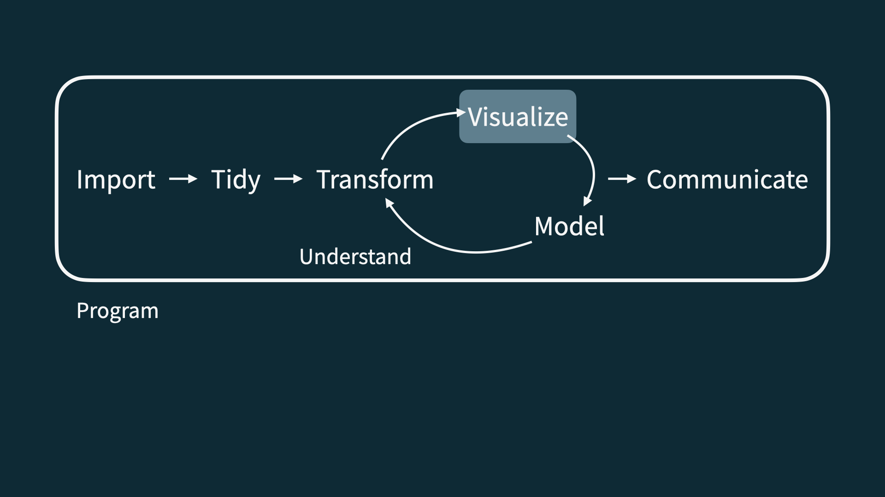

```{r setup, include=FALSE}
options(htmltools.dir.version = FALSE)

library(knitr)
library(tidyverse)
library(xaringan)
library(dataedu)
library(here)
```

# Agenda

1. Introductions to one another and the class
1. A brief introduction to data science and R
1. Discussion of the syllabus

---

# Introductions!

* Alex Lishinski, Ph.D. (they/them)
* Contact: 
  * [alishins@utk.edu](mailto:alishins@utk.edu)
* Postdoctoral researcher, CS Education, University of Tennessee, Knoxville
* Primary areas of interest:
  * Computer Science education
  * Quantitative research methods
  * Data science in education
* Former philosopher

---
  
# Introductions!

1. Stuff about you
1. Why are you interested in data science?
1. What tools/experiences do you have for doing data science?
1. What do you think you want to get out of this course?

(10 minutes)

---

## Course FAQ

**Q - What data science background does this course assume?**  
A - None.

**Q - Is this an intro stat course?**  
A - While statistics $\ne$ data science, they are very closely related and have tremendous of overlap. Hence, this course is a great way to get started with statistics. However this course is *not* your typical high school statistics course.

**Q - Will we be doing computing?**   
A - Yes.

**Q - Is this an intro CS course?**  
A - No, but many themes are shared.

**Q - What computing language will we learn?**  
A - R.

---

```{r echo=FALSE, out.width="75%", fig.align="left"}
knitr::include_graphics("./img/excel.png")
```

---

```{r echo=FALSE, out.width="50%", fig.align="left"}
knitr::include_graphics("./img/r.png")
```

---

```{r echo=FALSE, out.width="73%", fig.align="left"}
knitr::include_graphics("./img/RStudio.png")
```

---

```{r echo=FALSE, out.width="90%", fig.align="left"}
knitr::include_graphics("./img/data-science-cycle/data-science-cycle.001.png")
```

---

```{r echo=FALSE, out.width="90%", fig.align="left"}
knitr::include_graphics("./img/data-science-cycle/data-science-cycle.002.png")
```

---

```{r echo=FALSE, out.width="90%", fig.align="left"}
knitr::include_graphics("./img/data-science-cycle/data-science-cycle.003.png")
```

---

```{r echo=FALSE, out.width="90%", fig.align="left"}

```

---

```{r echo=FALSE, out.width="90%", fig.align="left"}
knitr::include_graphics("./img/data-science-cycle/data-science-cycle.005.png")
```

---

```{r echo=FALSE, out.width="90%", fig.align="left"}
knitr::include_graphics("./img/data-science-cycle/data-science-cycle.006.png")
```

---

```{r echo=FALSE, out.width="90%", fig.align="left"}
knitr::include_graphics("./img/data-science-cycle/data-science-cycle.007.png")
```

---

```{r echo=FALSE, out.width="90%", fig.align="left"}
knitr::include_graphics("./img/data-science-cycle/data-science-cycle.008.png")
```

---

```{r echo=FALSE, out.width="90%", fig.align="left"}
knitr::include_graphics("./img/data-science-cycle/data-science-cycle.009.png")
```

---

# Over-arching design

The pedagogical framework *plays out* in the following specific ways:

1. You'll first hear about the concepts underlying what you can do 
1. You'll see examples of working out these ideas in practice
1. You'll try these ideas out on your own

---

# An argument for this class

- This presentation will make the argument that **you can use R and RStudio to solve
problems that are important to you**

- In doing so, you can **participate in a cool community of data scientists in education**

---

# Why learn R?

* It is capable of carrying out basic and complex statistical analyses
* It is able to work with data small (*n* = 30) and large (*n* = 100,000+) efficiently
* It is a programming language and so is quite flexible
* There is a great, inclusive community of users and developers (and teachers)
* It is increasingly used in education
* It can help you to carry out your educational analyses in open and trustworthy ways
* It is cross-platform, open-source, and freely-available

---

# RMarkdown

* RMarkdown is a data analysis "notebook" that combines text with code and output
* It is a great file type to use when beginning to use R and to create reproducible analyses
* It is fun to use because you can generate different types of output (Word, PDF, and even web-based)

---

# Let's look at a bit of code together

What do you think this code will do?

```{r, eval = FALSE}
sci_mo_processed %>% 
  filter(percentage_earned >= .60) %>% 
  select(student_id, course_id, percentage_earned))
```

---

# Let's look at a bit of code together

```{r}
sci_mo_processed %>% 
  filter(percentage_earned >= .60) %>% 
  select(student_id, course_id, percentage_earned)
```

---

# Let's look at a bit of code together

What do you think this code will do?

```{r, eval = FALSE}
sci_mo_processed %>% 
  filter(percentage_earned >= .60) %>% 
  arrange(desc(percentage_earned)) %>% 
  select(student_id, course_id, percentage_earned, TimeSpent)
```

---

# Let's look at a bit of code together

```{r}
sci_mo_processed %>% 
  filter(percentage_earned >= .60) %>% 
  select(student_id, course_id, percentage_earned, TimeSpent)
```

---

# Getting Started

- Download R: https://www.r-project.org/
- Download Rstudio: https://www.rstudio.com/products/rstudio/download/
- Set up a working directory for your class projects

---

# Syllabus

Assignments
- Homework
- Exams
- Final Project
- Others (data ethics, data science resources)

---

# Organization of the class

- Tuesdays - Homeworks due
- Tuesday class - Slides and demo
- Thursday class - Review HW and work through hands on activity

---

# Questions

What questions do you have? 

