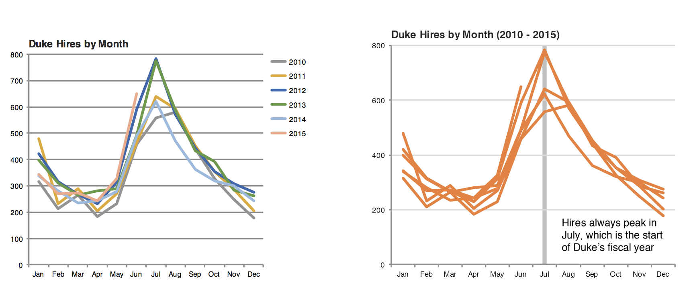

```{r, include = FALSE}
knitr::opts_chunk$set(echo = TRUE, fig.align = "center", message = FALSE)
```

# Welcome!

Welcome to *week 7*!

```{r echo = FALSE, out.width = "70%"}

```

**Record the meeting** 

```{r, include = TRUE, echo = FALSE}
library(here)
library(tidyverse)
```

---

# Discussion!

**One question:**

- What is one interesting or exciting thing you did or found out about when using R this past week?

**One reflection/discussion:**

- What is one take-away (large or small) that you can use in your own visualizations from the two readings from last week?
* 1: https://clauswilke.com/dataviz/histograms-density-plots.html
* 2: https://clauswilke.com/dataviz/visualizing-proportions.html

---

### Review of last week's class

- Review of the grammar of graphics

- Understanding visualizations by layers

- Understanding mapping of data to geoms

- Homework: counting, grouping and summarizing, recoding using a factor, and telling a story with data

---

### But first: an example

```{r, out.width = "80%", echo = FALSE}

```

---

### But first: an example

```{r, out.width = "80%", echo = FALSE}

```

---

### But first: an example

```{r, out.width = "80%", echo = FALSE}

```

---

### But first: an example

```{r, out.width = "80%", echo = FALSE}

```

---

### But first: an example

```{r, out.width = "80%", echo = FALSE}

```

---

### But first: an example

```{r, out.width = "80%", echo = FALSE}

```

---

### But first: an example

```{r, out.width = "80%", echo = FALSE}

```

---


### Two overarching goals of learning data viz in R

* Conceptual framework of visualization
+ Grammar of graphics and different mappings of data onto visual elements

* Details of implementation
+ How to build and refine plots layer by layer
+ Eventually: Interactive data viz with ggviz and shiny

---

### Telling a story

```{r echo = FALSE, out.width = "100%"}

```

---

### Telling a story

```{r echo = FALSE, out.width = "80%"}

```

---

### This week's topics

**Overview**

A. Using color  
B. Grouping and stacking bar charts  
C. Faceting plots  

---

### A. Using color

One high-level distinction to consider:

* Assigning a color to a geom 
* Mapping a variable (with `aes()`) a color to a geom

---

### A. Using color

**Assigning a color to a geom**

```{r, eval = FALSE}
colors()
```

```{r, eval = FALSE}
tidykids <- read_csv(here("content", "data", "tidykids.csv"))

tidykids %>% 
  filter(variable == "PK12ed") %>% 
  group_by(year) %>% 
  summarize(mean_inf_adj_perchild = mean(inf_adj_perchild)) %>% # b/c of multiple states
  ggplot(aes(x = year, y = mean_inf_adj_perchild)) +
  geom_point(color = "darkblue") +
  theme(text = element_text(size = 14))
```

---

### A. Using color

**Assigning a color to a geom**

```{r, eval = TRUE, echo = FALSE}
tidykids <- read_csv(here("content", "data", "tidykids.csv"))

tidykids %>% 
  filter(variable == "PK12ed") %>% 
  group_by(year) %>% 
  summarize(mean_inf_adj_perchild = mean(inf_adj_perchild)) %>% # b/c of multiple states
  ggplot(aes(x = year, y = mean_inf_adj_perchild)) +
  geom_point(color = "darkblue") +
  theme(text = element_text(size = 14))
```

---

### A. Using color

**Mapping a color to a geom**

```{r, eval = FALSE}
tidykids %>% 
  filter(variable %in% c("PK12ed", "highered", "pell")) %>% 
  group_by(variable, year) %>% 
  summarize(mean_inf_adj_perchild = mean(inf_adj_perchild)) %>% # b/c of multiple states
  ggplot(aes(x = year, y = mean_inf_adj_perchild, color = variable)) +
  geom_point() +
  theme(text = element_text(size = 14))
```

---

### A. Using color

**Mapping a color to a geom**

```{r, eval = TRUE, echo = FALSE, message = FALSE, fig.width = 8.5}
tidykids %>% 
  filter(variable %in% c("PK12ed", "highered", "pell")) %>% 
  group_by(variable, year) %>% 
  summarize(mean_inf_adj_perchild = mean(inf_adj_perchild)) %>% # b/c of multiple states
  ggplot(aes(x = year, y = mean_inf_adj_perchild, color = variable)) +
  geom_point() +
  theme(text = element_text(size = 14))
```

---

### A. Using color

**Use a scale function to modify a scale**

* `scale_color_*`
    * `scale_color_discrete`  
    * `scale_color_continous`  
    * `scale_color_brewer`  
    * `scale_color_manual()`  
* `scale_fill_*`
    * `scale_fill_discrete`  
    * `scale_fill_continous`  
    * `scale_fill_brewer`  
    * `scale_color_manual()`  

---

### A. Using color

**Removing the title from a scale**

```{r, eval = FALSE, message = FALSE}
p <- tidykids %>% 
  filter(variable %in% c("PK12ed", "highered", "pell")) %>% 
  group_by(variable, year) %>% 
  summarize(mean_inf_adj_perchild = mean(inf_adj_perchild)) %>% # b/c of multiple states
  ggplot(aes(x = year, y = mean_inf_adj_perchild, color = variable)) +
  geom_point() +
  theme(text = element_text(size = 14))

p + 
  scale_color_discrete("")
```

See the result on the next slide.

---

### A. Using color

**Removing the title from a scale**

```{r, eval = TRUE, echo = FALSE, message = FALSE}
p <- tidykids %>% 
  filter(variable %in% c("PK12ed", "highered", "pell")) %>% 
  group_by(variable, year) %>% 
  summarize(mean_inf_adj_perchild = mean(inf_adj_perchild)) %>% # b/c of multiple states
  ggplot(aes(x = year, y = mean_inf_adj_perchild, color = variable)) +
  geom_point() +
  theme_minimal() +
  theme(text = element_text(size = 14))

p + 
  scale_color_discrete("")
```

---

### A. Using color

**Changing the colors of a scale using a "color brewer" scale**:

```{r, eval = TRUE, message = FALSE, out.width = "400px", fig.align='center'}
p + 
  scale_color_brewer()
```

---

### A. Using color

**Changing the colors of a scale using a "color brewer" scale**:

The "color brewer" functions support three kinds of scales:

* sequential (`type = "seq"`) for ordered data
* divergent (`type = "div"`) for data with a natural midpoint and two extremes
* qualitative (`type = "qual"`) for categorical/qualitative data

https://colorbrewer2.org/#type=sequential&scheme=BuGn&n=3
https://www.r-graph-gallery.com/38-rcolorbrewers-palettes.html

*What kind of palette would be best for our last plot?*

---

### A. Using color

**Changing the colors of a scale using a "color brewer" scale**:

```{r, eval = TRUE, message = FALSE, out.width = "400px"}
p +
  scale_color_brewer(type = "qual")
```

---

### A. Using color

**Changing the colors of a scale using a "color brewer" scale**:

```{r, eval = TRUE, message = FALSE, out.width = "400px"}
p + 
  scale_color_brewer(type = "qual", palette = 2)
```

---

### A. Using color

https://brand.utk.edu/standards/colors/

```{r, eval = TRUE, message = FALSE, out.width="400px"}
p + 
  scale_color_manual(values = c("#FF8200", "#58595B", "8D2048"))
```

---

### B. Grouping and stacking bar charts

**Removing the title from a scale**

```{r, eval = FALSE, message = FALSE}
p <- tidykids %>% 
  filter(variable %in% c("PK12ed", "highered", "pell")) %>% 
  group_by(variable, year) %>% 
  summarize(mean_inf_adj_perchild = mean(inf_adj_perchild)) %>% # b/c of multiple states
  ggplot(aes(x = year, y = mean_inf_adj_perchild, color = variable)) +
  geom_col() +
  theme_minimal() +
  theme(text = element_text(size = 14)) 

p + 
  scale_color_discrete("")
```

See the result on the next slide.

---

### B. Grouping and stacking bar charts

**What might we change?**

```{r, eval = FALSE, echo = TRUE, message = FALSE, out.width="500px"}
tidykids %>% 
  filter(variable == "PK12ed",
         state %in% c("Tennessee", "Kentucky")) %>% 
  ggplot(aes(x = year, y = inf_adj_perchild, fill = state)) +
  geom_col() +
  theme_minimal() +
  theme(text = element_text(size = 14)) +
  scale_fill_brewer(type = "qual", palette = 7) +
  xlab("") +
  ylab("Mean Inflation-Adjusted Spending Per Child")
```

---

### B. Grouping and stacking bar charts

```{r, echo = FALSE}
tidykids %>% 
  filter(variable == "PK12ed",
         state %in% c("Tennessee", "Kentucky")) %>% 
  ggplot(aes(x = year, y = inf_adj_perchild, fill = state)) +
  geom_col() +
  theme_minimal() +
  theme(text = element_text(size = 14)) +
  scale_fill_brewer(type = "qual", palette = 7) +
  xlab("") +
  ylab("Mean Inflation-Adjusted Spending Per Child")
```

---

### B. Grouping and stacking bar charts

**Using the `position = "dodge"` argument**

```{r, eval = FALSE, message = FALSE}
tidykids %>% 
  filter(variable == "PK12ed",
         state %in% c("Tennessee", "Kentucky")) %>% 
  ggplot(aes(x = year, y = inf_adj_perchild, fill = state)) +
  geom_col(position = "dodge") +
  theme_minimal() +
  theme(text = element_text(size = 14)) +
  scale_fill_brewer(type = "qual", palette = 7)
```

---

### B. Grouping and stacking bar charts

```{r, eval = TRUE,echo = FALSE, message = FALSE}
tidykids %>% 
  filter(variable == "PK12ed",
         state %in% c("Tennessee", "Kentucky")) %>% 
  ggplot(aes(x = year, y = inf_adj_perchild, fill = state)) +
  geom_col(position = "dodge") +
  theme_minimal() +
  theme(text = element_text(size = 14)) +
  scale_fill_brewer(type = "qual", palette = 7)
```

---

### B. Grouping and stacking bar charts

**A use for stacking**

```{r, eval = FALSE, echo = TRUE, message = FALSE, out.width="500px"}
tidykids %>% 
  filter(variable %in% c("PK12ed", "highered"),
         state %in% c("Tennessee")) %>% 
  group_by(year) %>% 
  mutate(prop_of_edu_spending = inf_adj_perchild / sum(inf_adj_perchild)) %>% 
  ggplot(aes(x = year, y = prop_of_edu_spending, fill = variable)) +
  geom_col(position = "stack") +
  theme_minimal() +
  theme(text = element_text(size = 14)) +
  scale_fill_brewer(type = "qual", palette = 7) +
  xlab("") +
  ylab("Mean Inflation-Adjusted Spending Per Child")
```

---

### B. Grouping and stacking bar charts

**A use for stacking**

```{r, out.width = "500px", echo = FALSE}
tidykids %>% 
  filter(variable %in% c("PK12ed", "highered"),
         state %in% c("Tennessee")) %>% 
  group_by(year) %>% 
  mutate(prop_of_edu_spending = inf_adj_perchild / sum(inf_adj_perchild)) %>% 
  ggplot(aes(x = year, y = prop_of_edu_spending, fill = variable)) +
  geom_col(position = "stack") +
  theme_minimal() +
  theme(text = element_text(size = 14)) +
  scale_fill_brewer(type = "qual", palette = 7) +
  xlab("") +
  ylab("Mean Inflation-Adjusted Spending Per Child")
```
---

### C. Faceting plots

**Faceting plots with `facet_wrap()`**

**States combined**

```{r, eval = FALSE, echo = TRUE}
tidykids %>% 
  filter(variable == "PK12ed",
         state %in% c("Tennessee", "Kentucky", "North Carolina", "Virginia", "Georgia", "Alabama", "Mississippi", "Arkansas", "Missouri")) %>% 
  group_by(year) %>% 
  summarize(mean_inf_adj_perchild = mean(inf_adj_perchild)) %>% 
  ggplot(aes(x = year, y = mean_inf_adj_perchild)) +
  geom_point() +
  geom_line()
```

---

### C. Faceting plots

```{r, eval = TRUE, echo = FALSE}
tidykids %>% 
  filter(variable == "PK12ed",
         state %in% c("Tennessee", "Kentucky", "North Carolina", "Virginia", "Georgia", "Alabama", "Mississippi", "Arkansas", "Missouri")) %>% 
  group_by(year) %>% 
  summarize(mean_inf_adj_perchild = mean(inf_adj_perchild)) %>% 
  ggplot(aes(x = year, y = mean_inf_adj_perchild)) +
  geom_point() +
  geom_line()
```

---

### C. Faceting plots

**States faceted**

```{r, eval = FALSE, echo = TRUE}
tidykids %>% 
  filter(variable == "PK12ed",
         state %in% c("Tennessee", "Kentucky", "North Carolina", "Virginia", "Georgia", "Alabama", "Mississippi", "Arkansas", "Missouri")) %>% 
  ggplot(aes(x = year, y = inf_adj_perchild)) +
  geom_point() +
  geom_line() +
  facet_wrap(~state)
```

---

### C. Faceting plots

```{r, eval = TRUE, echo = FALSE}
tidykids %>% 
  filter(variable == "PK12ed",
         state %in% c("Tennessee", "Kentucky", "North Carolina", "Virginia", "Georgia", "Alabama", "Mississippi", "Arkansas", "Missouri")) %>% 
  ggplot(aes(x = year, y = inf_adj_perchild)) +
  geom_point() +
  geom_line() +
  facet_wrap(~state)
```

---


### C. Faceting plots

**Variables of spending faceted**

```{r, eval = FALSE, echo = TRUE}
tidykids %>% 
  filter(state == "Tennessee",
         variable %in% c("HeadStartPriv", "highered", "PK12ed", "pell", "edserv", "edsubs")) %>% 
  group_by(year) %>% 
  ggplot(aes(x = year, y = inf_adj_perchild)) +
  geom_point() +
  geom_line() +
  facet_wrap(~variable)
```

---

### C. Faceting plots

```{r, eval = TRUE, echo = FALSE}
tidykids %>% 
  filter(state == "Tennessee",
         variable %in% c("HeadStartPriv", "highered", "PK12ed", "pell", "edserv", "edsubs")) %>% 
  group_by(year) %>% 
  ggplot(aes(x = year, y = inf_adj_perchild)) +
  geom_point() +
  geom_line() +
  facet_wrap(~variable)
```

---

### Where to next with respect to data viz?

- Interactive visualizations?
  - gganimate: https://gganimate.com/articles/gganimate.html
  - magick: https://cran.r-project.org/web/packages/magick/vignettes/intro.html
  - Shiny: https://shiny.rstudio.com
  
- Books:
  - https://socviz.co/
  - https://clauswilke.com/dataviz
  
- Resources
  - http://rweekly.org/
  - https://github.com/rfordatascience/tidytuesday; [#tidytuesday on Twitter](https://twitter.com/hashtag/tidytuesday?lang=en)
  
---

```{r, out.width="50%", echo = FALSE}

```

---

**This week**

* Homework 5: Available Thursday (combination of previous HWs 5 and 6)
  * Theming with color
  * Stacking and dodging
  * Faceting

* Readings
  * https://r4ds.had.co.nz/graphics-for-communication.html
  * https://clauswilke.com/dataviz/figure-titles-captions.html
  * https://clauswilke.com/dataviz/color-pitfalls.html

---

### Wrapping up

On Slack channel:

- What is one thing you learned today?
- What is something you want to learn more about? 
- Share your feelings in GIF form!

We really appreciate being able to see these reactions and get this feedback!
